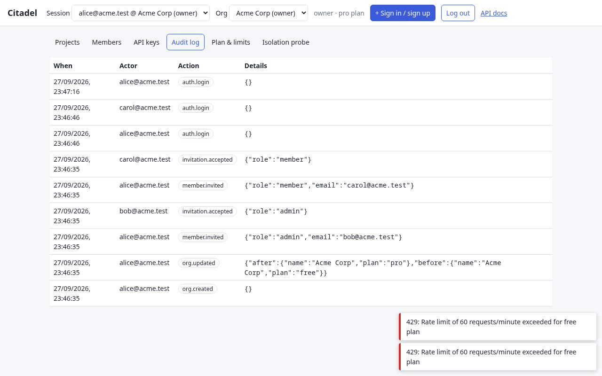
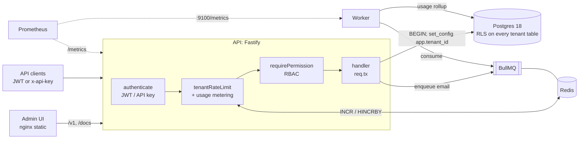

# Citadel

**A multi-tenant B2B SaaS backend where tenant isolation is enforced by the database, not by hoping every query remembers a `WHERE tenant_id = ?`.**

Citadel is a reference backend for B2B SaaS: organizations, members and invitations, JWT sessions with refresh-token rotation, per-tenant API keys, role-based access control, plan tiers with rate limits and usage metering, an audit log, background jobs, and a sample projects/tasks domain. It ships with an admin UI where you can watch isolation, role restrictions and rate limits work.



> _GIF placeholder: a walkthrough of switching orgs, the isolation probe returning 404, and a rate-limit burst._

## Features

- **Tenant isolation with Postgres Row-Level Security.** Shared schema with `tenant_id` on every table. Each request runs in a transaction with `app.tenant_id` set, and RLS policies filter every read and write. The app connects as a role with no `BYPASSRLS` and no `DELETE` privilege.
- **Auth.** Email/password (scrypt), short-lived JWT access tokens, and opaque refresh tokens that rotate on every use. Reusing a refresh token revokes its whole family. Also org invitations and per-tenant API keys stored as SHA-256 hashes.
- **RBAC.** `owner` / `admin` / `member` roles, a single permission matrix, and a `requirePermission()` guard. The role is read from the membership on every request, so demotions and removals take effect immediately.
- **Plans and limits.** `free` / `pro` / `enterprise` tiers set per-tenant rate limits (Redis) and caps on projects, members and API keys (HTTP 402 when exceeded).
- **Usage metering.** Every authenticated call is counted in Redis, and a BullMQ job rolls the counts up into Postgres every minute.
- **Audit log.** Sensitive actions are written in the same transaction as the change they describe.
- **Soft deletes and cursor pagination.** IDs are UUIDv7, so `id < cursor` gives stable, index-backed pages.
- **Background jobs.** BullMQ queues for invitation emails and usage rollups, run by a separate worker process.
- **OpenAPI.** The spec is generated from the same JSON Schemas Fastify uses for validation. Swagger UI is at `/docs`.
- **Observability.** Structured pino logs carry `request_id` and `tenant_id`. Prometheus metrics are at `/metrics`, with liveness at `/healthz` and readiness at `/readyz`.

## Architecture



Request lifecycle: `authenticate` resolves the caller to `{tenantId, role, plan}`. `tenantRateLimit` does a single Redis `MULTI` that increments the per-minute window and the daily usage hash. `requirePermission` checks the role. The handler calls `req.tx(fn)`, which opens a transaction, runs `set_config('app.tenant_id', $1, true)` and passes `fn` a client whose every query is filtered by RLS.

## Multi-tenancy strategy

### What Citadel does

1. **Shared schema, `tenant_id` column on every tenant-owned table.**
2. **RLS policies** of the form `USING (tenant_id = current_tenant_id()) WITH CHECK (...)` on every tenant table, plus `FORCE ROW LEVEL SECURITY`.
3. **A least-privileged app role** (`citadel_app`): `NOSUPERUSER NOBYPASSRLS`, not the table owner, and granted only `SELECT/INSERT/UPDATE`. It cannot disable RLS, cannot turn `row_security` off, and cannot hard-delete anything.
4. **Transaction-local tenant context.** `set_config(..., true)` is scoped to the transaction, so a pooled connection cannot carry tenant A's context into tenant B's request. When the setting is missing, `current_tenant_id()` is `NULL` and every table reads as empty.
5. **Narrow `SECURITY DEFINER` functions** for the few lookups that must happen before a tenant is known: API-key authentication, "which orgs is this user in", and invitation lookup by token. The app role never gets a general bypass.
6. **Composite foreign keys** (`tasks (tenant_id, project_id) → projects (tenant_id, id)`). FK checks bypass RLS, so a plain FK would let a task in tenant A reference a project in tenant B.

`test/isolation.test.js` checks this as tenant A with deliberately buggy SQL: unfiltered `SELECT *`, `WHERE tenant_id = <B>`, joins, blanket `UPDATE`, inserts that claim tenant B's id, `DELETE`, disabling RLS, and `row_security = off`. It also checks that the tenant setting never leaks across pooled connections and that a JWT forged for another org is rejected.

### Tradeoffs

|                        | **Shared schema + RLS** (Citadel)                                           | Schema per tenant                                                     | Database per tenant                                          |
| ---------------------- | --------------------------------------------------------------------------- | --------------------------------------------------------------------- | ------------------------------------------------------------ |
| Isolation              | Logical, enforced by Postgres policies. A bug in a policy affects everyone. | Stronger namespace boundary; relies on `search_path` being right      | Strongest; separate process/storage, easy per-tenant restore |
| Tenants per cluster    | Millions                                                                    | Thousands (catalog bloat, migration time grows with N)                | Tens to hundreds per server                                  |
| Migrations             | One migration, one time                                                     | N migrations; partial failure leaves tenants on different versions    | N databases to migrate and monitor                           |
| Connection pooling     | One pool for all tenants                                                    | One pool if you `SET search_path`, but prepared statements get tricky | One pool per tenant; connections become the bottleneck       |
| Noisy neighbours       | Shared: need rate limits, query timeouts, per-tenant indexes                | Shared                                                                | Isolated                                                     |
| Cross-tenant analytics | Trivial (as a privileged role)                                              | `UNION` across schemas                                                | ETL                                                          |
| Compliance / residency | Hard to place one tenant in another region                                  | Hard                                                                  | Easy: put the DB where the customer needs it                 |
| Cost per tenant        | Lowest                                                                      | Low                                                                   | Highest                                                      |

Shared schema with RLS is the right default for a B2B product with many small or medium tenants: it has the cheapest operations, and the database turns forgetting a tenant filter from a data breach into an empty result. The usual next step is a **hybrid**: keep everyone on the shared cluster and move the few enterprise tenants that need residency or hard isolation to a dedicated database with the same schema. Because every row already carries `tenant_id`, that move is a copy, not a rewrite.

Costs of the RLS approach worth knowing:

- Every tenant query runs in an explicit transaction (`BEGIN` / `set_config` / `COMMIT`), which adds round trips. The load-test numbers below include this.
- Policies must be kept in step with new tables. The migration's `DO` block and the isolation test are the guardrail.
- Global tables (`users`, `refresh_tokens`) are deliberately outside RLS and only reachable through auth code paths.

## Plans

| Plan       | Requests/min | Projects  | Members   | API keys  |
| ---------- | ------------ | --------- | --------- | --------- |
| free       | 60           | 3         | 3         | 1         |
| pro        | 600          | 100       | 25        | 10        |
| enterprise | 6000         | unlimited | unlimited | unlimited |

Defined in `src/lib/plans.js`. The rate limiter uses a fixed one-minute window per tenant and returns `x-ratelimit-*` headers, with `retry-after` on a 429.

## Running it

### Everything with Docker (one command)

```bash
docker compose up --build
docker compose run --rm seed     # optional: demo tenants
```

| Service        | URL                                                        |
| -------------- | ---------------------------------------------------------- |
| Admin UI       | http://localhost:8080                                      |
| API docs       | http://localhost:8080/docs (or http://localhost:3000/docs) |
| API            | http://localhost:3000/v1                                   |
| API metrics    | http://localhost:3000/metrics                              |
| Health / ready | http://localhost:3000/healthz, /readyz                     |

Seeded logins (password `password123`):

| Email             | Access                                       |
| ----------------- | -------------------------------------------- |
| `alice@acme.test` | owner of Acme (pro), member of Globex (free) |
| `bob@acme.test`   | admin of Acme                                |
| `carol@acme.test` | member of Acme                               |
| `dan@globex.test` | owner of Globex (free)                       |

### Demo walkthrough

1. Log in as `alice@acme.test`, then use **+ Sign in / sign up** to add a session for `dan@globex.test`. The **Session** dropdown now switches between the two orgs. Alice can also switch org with the **Org** dropdown, since she is in both.
2. **Isolation:** in Globex, click _copy id_ on a project. Switch to Acme, open **Isolation probe** and paste the ID. The result is `404`, because the row does not exist as far as Acme's transaction can see.
3. **Roles:** log in as `carol@acme.test` (member). Deleting a project, opening the audit log or creating API keys returns `403`.
4. **Rate limits:** as Dan (free plan, 60/min), open **Plan & limits** and fire a burst of 80. Expect 60 × `200` and 20 × `429`. Switch to Alice (pro) and the same burst passes.
5. **Invitations:** invite someone from **Members**. The worker logs the email (`docker compose logs worker`) and the UI shows the accept link.
6. **Audit log:** everything above (role changes, removals, plan changes, deletions, key creation, logins) appears under **Audit log**.

### Local development

Requires Node 22+, Postgres 18 and Redis.

```bash
cp .env.example .env
docker compose up -d postgres redis   # or use your own
npm install
npm run migrate
npm start            # API on :3000
npm run worker       # background jobs
npm test             # needs Postgres + Redis
npm run lint && npm run format:check
```

Ports are configurable if the defaults are taken: `PG_PORT`, `REDIS_PORT`, `API_PORT` and `UI_PORT`, for example in a `.env` next to `docker-compose.yml`.

`npm run migrate` connects as the owner (`MIGRATION_DATABASE_URL`). That role must be a superuser or have `BYPASSRLS`, because it owns the `SECURITY DEFINER` functions. The runner then creates or updates the `citadel_app` role the API uses.

## API

The interactive docs are at **`/docs`** (OpenAPI 3 JSON at `/docs/json`). Authenticate with `Authorization: Bearer <accessToken>` or `x-api-key: ctd_…`.

| Area     | Endpoints                                                                                       |
| -------- | ----------------------------------------------------------------------------------------------- |
| Auth     | `POST /v1/auth/signup · login · refresh · logout · switch`, `GET /v1/auth/me`                   |
| Org      | `GET/PATCH /v1/org`, `GET /v1/org/members`, `PATCH/DELETE /v1/org/members/:userId`              |
| Invites  | `GET/POST /v1/org/invitations`, `POST /v1/invitations/accept`                                   |
| API keys | `GET/POST /v1/api-keys`, `DELETE /v1/api-keys/:id`                                              |
| Projects | `GET/POST /v1/projects`, `GET/PATCH/DELETE /v1/projects/:id`, `GET/POST /v1/projects/:id/tasks` |
| Tasks    | `PATCH/DELETE /v1/tasks/:id`                                                                    |
| Audit    | `GET /v1/audit-logs?cursor=&limit=&action=`                                                     |
| Usage    | `GET /v1/usage`                                                                                 |

List endpoints return `{ data, nextCursor }`. To get the next page, pass `?cursor=<nextCursor>`.

## Tests

`npm test` uses `node:test` and runs in-process against real Postgres and Redis through `fastify.inject`.

| File                      | What it proves                                                                                                                                                                                                                 |
| ------------------------- | ------------------------------------------------------------------------------------------------------------------------------------------------------------------------------------------------------------------------------ |
| `test/isolation.test.js`  | Buggy SQL as tenant A never reads, updates or writes tenant B's rows; RLS can't be disabled; no context leaks across the pool; forged cross-org JWTs are rejected; every HTTP route returns 404 for another tenant's resources |
| `test/rbac.test.js`       | Permission matrix; member/admin/owner boundaries; role changes and removals apply immediately; last-owner protection; API-key roles                                                                                            |
| `test/rate-limit.test.js` | Free tenant is cut off at 60/min while another tenant is unaffected; plan caps return 402 and lift after an upgrade; usage rolls up to Postgres                                                                                |
| `test/auth.test.js`       | Refresh rotation and reuse detection; hashed secrets; org switching; invitation acceptance; pagination; soft deletes; health, metrics and docs                                                                                 |

## Load test

`npm run loadtest` (script: `scripts/loadtest.js`) creates many enterprise tenants and hammers `GET /v1/projects` with their tokens, so every request goes through JWT verification, the membership lookup, the Redis rate limiter and metering, and an RLS-scoped transaction. `GET /healthz` is included as a framework baseline.

Measured on 2026-09-27: one API container (a single Node 24 process) with Postgres 18 and Redis 8 in Docker, autocannon on the same laptop (AMD Ryzen 7 7730U, 16 threads, 14 GB RAM), 50 connections, 20 s per run, 50 tenants. The per-IP auth limit was raised for setup only (`AUTH_RATE_LIMIT_PER_MINUTE=10000`) so the script could create the tenants.

| Run | Endpoint                              | Throughput  | p50   | p97.5 | p99   | Errors / non-2xx |
| --- | ------------------------------------- | ----------- | ----- | ----- | ----- | ---------------- |
| 1   | `GET /healthz` (baseline)             | 5,778 req/s | 6 ms  | 22 ms | 30 ms | 0 / 0            |
| 1   | `GET /v1/projects` (full tenant path) | 877 req/s   | 55 ms | 75 ms | 78 ms | 0 / 0            |
| 2   | `GET /healthz` (baseline)             | 5,490 req/s | 9 ms  | 18 ms | 22 ms | 0 / 0            |
| 2   | `GET /v1/projects` (full tenant path) | 975 req/s   | 50 ms | 67 ms | 73 ms | 0 / 0            |

Each tenant request makes two short RLS transactions: a membership/plan lookup, then the handler, each doing `BEGIN` / `set_config` / query / `COMMIT`. It also does one Redis `MULTI` and writes two JSON log lines. That per-request round-trip budget, not RLS policy evaluation, is what separates it from the baseline. See future work for how to cut it. Reproduce with:

```bash
AUTH_RATE_LIMIT_PER_MINUTE=10000 docker compose up -d --build
API_URL=http://localhost:3000 npm run loadtest
```

## Project structure

```
migrations/            SQL migrations (schema, RLS policies, definer functions)
src/
  app.js               Fastify app: plugins, hooks, route wiring
  server.js            API entrypoint
  worker.js            BullMQ worker (emails, usage rollup) + worker metrics
  config.js
  db/                  pool, withTenant(), migration runner
  lib/                 crypto, rbac, plans, pagination, metrics, queues, redis
  middleware/          authenticate, rate-limit
  modules/
    auth/              signup/login/refresh/switch, token issuance + rotation
    orgs/              org settings, members, invitations
    api-keys/
    projects/          sample domain: projects + tasks
    audit/
    usage/
ui/                    admin UI (static, served by nginx)
scripts/               seed, load test
test/                  node:test suites
```

## Future work

- **Sliding-window or token-bucket rate limiting** (Lua script) to remove the 2× burst allowed at fixed-window edges; separate limits per endpoint class.
- **Monthly quotas** on metered usage (API calls), with soft and hard limits and overage billing through Stripe metered billing.
- **Real email delivery** (SES or Postmark) behind the existing queue, with templates and bounce handling.
- **SSO / SAML / SCIM** for enterprise orgs, plus MFA.
- **Hybrid tenancy:** a routing layer that sends selected enterprise tenants to dedicated databases.
- **Tenant-aware Postgres pool limits and statement timeouts** to contain noisy neighbours.
- **OpenTelemetry tracing** across API → queue → worker, with the tenant as a span attribute.
- **Audit log export and retention** (partition by month, archive to object storage).
- **Hard-delete / GDPR erasure jobs** for soft-deleted data after a retention window.
- **Fewer round trips per request:** fold the membership lookup into the handler's transaction and send `BEGIN` and `set_config` in one round trip; cache the plan per tenant.
- **Refresh tokens in httpOnly cookies** for the browser UI, instead of `localStorage`.
